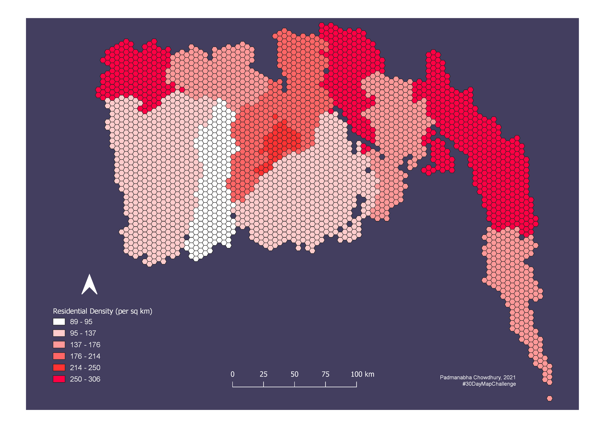
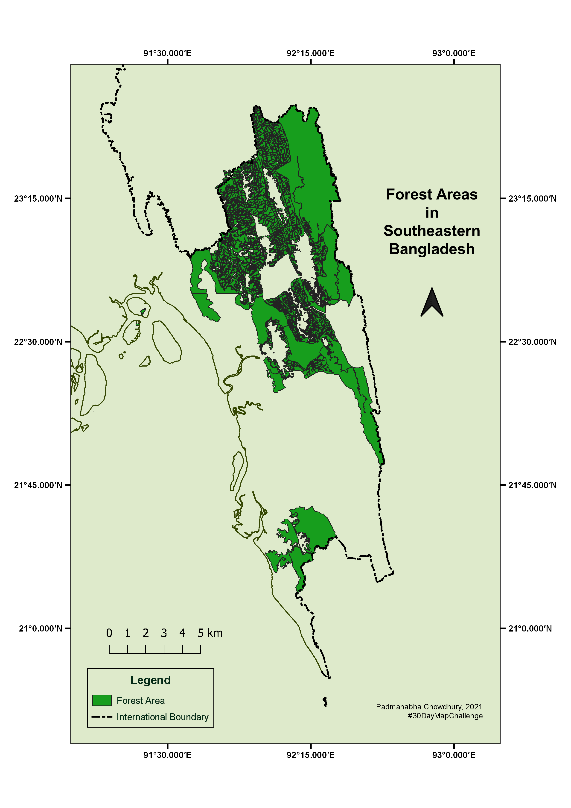

# 30DayMapChallenge-2021
This repository is the collection of maps I created for the 30DayMapChallenge during November, 2021. #30DayMapChallenge is a daily spatial data visualization challenge launched by <a href="https://twitter.com/tjukanov">Topi Tjukanov</a>. One has to create maps on selected themes and publish on twitter or any other social media platforms. 

For More Details: <a href="https://github.com/tjukanovt/30DayMapChallenge">30DayMapChallenge</a>.    

I started my journey with an aim to completing the challenge without any interruption. Unfortunately, I could not make all the maps due to my sudden illness. I used QGIS to produce the maps (except the [Earth is not Flat](#the-earth-is-not-flat)). Here are the 17 maps I created throughout the challenge:

## Points 

The location of power plants in coastal areas of Bangladesh. Original post on <a href="https://twitter.com/PadmanabhaChy/status/1455031287203254272?s=20">Twitter</a> 

## Lines

The intense drainage network of coastal rivers in Bangladesh. Original post on <a href="https://twitter.com/PadmanabhaChy/status/1455439560423346178?s=20">Twitter</a> 

## Polygons

Polders in coastal areas of Bangladesh. Original post on <a href="https://twitter.com/PadmanabhaChy/status/1455900378768150528?s=20">Twitter</a>

## Hexagons

Residential density is the number of households per unit area. The map shows the residential density in coastal areas. Original post on <a href="https://twitter.com/PadmanabhaChy/status/1456121068054216709?s=20">Twitter</a>

## Data Challenge 1 : OpenStreetMap

Dhaka, the capital of Bangladesh has a very dense network of streets. Original post on <a href="https://twitter.com/PadmanabhaChy/status/1456486943743623171?s=20">Twitter</a>

## Red

Vaccination for COVID-19 began in Bangladesh from February 2021. The map illustrates the vaccinated population all over the country. Original post on <a href="https://twitter.com/PadmanabhaChy/status/1456853722676416514?s=20">Twitter</a>

## Green

Forests in southeastern Bangladesh. Most of the areas are in Chittagong hill tracts. Original post on <a href="https://twitter.com/PadmanabhaChy/status/1457197591423111171?s=20">Twitter</a>

## Blue

The location of wetlands all over Bangladesh. Original post on <a href="https://twitter.com/PadmanabhaChy/status/1457776163074441221?s=20">Twitter</a>

## Monchrome

All types of highways in Bangladesh. Original post on <a href="https://twitter.com/PadmanabhaChy/status/1458024669571731456?s=20">Twitter</a>

## Raster
Modified Normalized Difference Water Index (MNDWI) is very efficient in differetiating water from land. Landsat 8 satellite image covering the eastern coast of Bangladesh was used to calculate the index. Original post on <a href="https://twitter.com/PadmanabhaChy/status/1458319377397272583?s=20">Twitter</a>

## 3D

The bottom topography of the Bay of Bengal. Original post on <a href="https://twitter.com/PadmanabhaChy/status/1458716368463749124?s=20">Twitter</a>

## Population

The indigenous people are all over Bangladesh; mostly in south eastern part. Original post on <a href="https://twitter.com/PadmanabhaChy/status/1459030187878715393?s=20">Twitter</a>

## Data Challenge 2 : Natural Earth

Coral reefs in the Pacific ocean are one of the most important components of the global marine ecosystem. 
Original post on <a href="https://twitter.com/PadmanabhaChy/status/1459509315987914757?s=20">Twitter</a>

## Map made without a computer

Rice is the staple food in Bangladesh. The map is made using only rice. Original post on <a href="https://twitter.com/PadmanabhaChy/status/1460071495548297218?s=20">Twitter</a>

## Urban

Dhaka metropolitan city, the most significant urban area of Bangladesh. Original post on <a href="https://twitter.com/PadmanabhaChy/status/1460580364586405891?s=20">Twitter</a>

## The Earth is not flat

Turning 3D earth into 2D map. This part is made using MS Excel 2016. Original post on <a href="https://twitter.com/PadmanabhaChy/status/1464957193472528388?s=20">Twitter</a>

## Null

No data, only the boundary of Bangladesh. Original post on <a href="https://twitter.com/PadmanabhaChy/status/1465287071384301569?s=20">Twitter</a>

